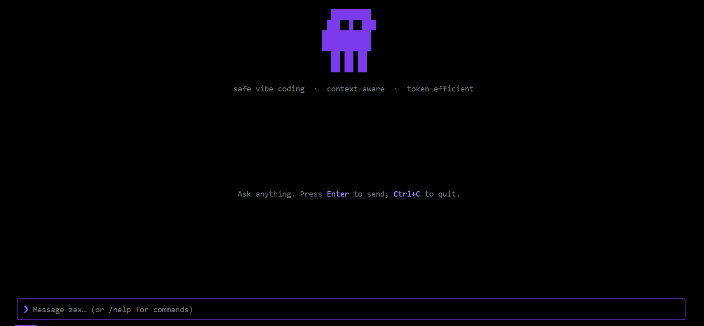

# zex - AI Coding Assistant

<p align="center">
  
</p>

<p align="center">
  <strong>Context-Aware · Security-First · Token-Efficient</strong>
</p>

<p align="center">
  
  
  
  
  
</p>

`zex` is a CLI-based AI coding assistant designed to solve the "context pollution" problem. Most assistants either send too much or too little context. `zex` manages context deliberately, pruning stale data between turns and keeping a strict token budget while enforcing military-grade security guardrails.

---

### Security Guardrails

Security is not an afterthought. Every interaction is gated by a multi-tier security layer:

- **In-Process Scanner**: Real-time scanning for 7 critical vulnerability patterns (XSS, SQLi, Command Injection) before any file write occurs.
- **Automated Project Audit**: Scans your codebase on launch to detect your tech stack (Next.js, Express, etc.) and identify pre-existing security gaps.
- **Vulnerability Blocking**: Gated write tools (`write_file`, `patch_file`) that prevent the agent from introducing insecure code.
- **Security Dashboard**: The `/security` command provides a detailed audit log of all blocks, warnings, and findings in your session.

### Advanced Context Hygiene

- **Semantic Chunk Pruner**: Scores history by relevance, recency, and importance; greedily packs within a 128k token budget using exact `js-tiktoken` counts.
- **Relevance-Aware GC**: Reference-counted chunk store with lease eviction; tool results compressed only when old, large, and unreferenced.
- **Dual Cache**: Exact (SHA-256) + semantic (cosine similarity) response cache with file-watcher invalidation.
- **TOON Encoding**: Compact encoding for directory listings and search results (~50% token reduction).
- **Intent Parser + Clarifier**: Fast regex intent extraction (action, files, risk level) plus LLM disambiguation for vague requests.
- **Persistent Memory**: `/remember` and `/recall` for cross-session learnings stored in `~/.zex/memory.json`.

### Core Features

- **Multi-Key Rotation**: Automatically cycles through your Gemini API key pool to bypass rate limits and ensure uninterrupted workflow.
- **Multi-Agent DAG** (opt-in via `"multiAgent": true`): Planner → Coder → Tester → Reviewer with debugger path for `/debug` intents.
- **Collaborative Debugging** (`/debug`): Coder + Debugger + Reviewer propose fixes, weighted vote picks winner.
- **Dependency Auditing** (`/deps`): npm audit integration + heuristic fallback for CVE detection.
- **Cost Tracking** (`/stats --budget`): Per-agent USD spend with org budget cap enforcement.
- **Memory Clustering** (`/cluster`): Auto-merges duplicate `/remember` entries on startup.
- **Enterprise (Q4)**:
  - Org policies via `~/.zex/org.json` (see `org.example.json`)
  - SAML/LDAP/API-key auth stubs (`/login`, `ZEX_AUTH_TOKEN`)
  - Persistent audit log (`~/.zex/audit/`, `/audit`)
  - Fine-tune export (`/export-finetune` → JSONL dataset)
- **Slash Commands**:
  - `/context` — token budget and context composition
  - `/stats` — cache hits, pruner runs, agent timings
  - `/remember` / `/recall` — persistent memory
  - `/export` — export session as markdown
  - `/undo` / `/redo` — file change history
  - `/security`, `/plan`, `/keys`, `/config`, `/reset`
- **Streaming TUI**: A beautiful, reactive terminal interface built with React (Ink).

### Advantages

- **Extreme Token Efficiency**: Do more with less context.
- **Safe Vibe Coding**: Focus on building while `zex` handles context management and security.
- **Smart Pruning**: Keeps your context window fresh and free of repetitive tool logs.

---

### 🏁 Getting Started

#### Prerequisites
- Node.js 18+ or Bun
- Multiple Gemini API Keys

#### Installation
```bash
# Windows / OneDrive: use npm (bun install can leave empty placeholder folders)
npm install

# macOS / Linux
bun install
```

#### Run
```bash
bun dev
# or: npm start
```

Set your API key before chatting:
```bash
# PowerShell
$env:GEMINI_API_KEY = "your-key-here"
```
